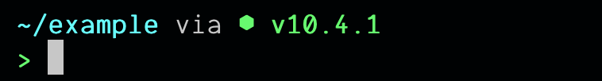

# Configuration

In order to change the default configuration of starship, start by creating a `starship.toml` file in your home config folder:

```shell
touch ~/.config/starship.toml
```

Any overrides will go in there.

## Format

```toml
[module]
key = "value"

# Example which changes the prompt to use > instead of ➜ segment
[char]
symbol = ">"
# false by default. If true, the module would not show in the prompt
disabled = "false"
```

**Module**: A component in the prompt giving information based on contextual information from your OS. For example, the nodejs module shows the version of NodeJS that is currently installed on your computer, if your current directory is a NodeJS project.

**Segment**: Smaller sub-components that compose a module. For example, the symbol segment in the nodejs module contains the character that is shown before the version number (⬢ by default).

Here is the representation of the node module. You can override any of these in your config file **other than the prefix and suffix** as well as disable the module entirely:

```
[prefix]      [symbol]     [version]    [suffix]
 "via "         "⬢"        "v10.4.1"       ""
```

### Configuration keys

We have two types of configuration keys right now.

- `disabled`, a boolean, which will work on any moudle and accepts a boolean value. If it's set to `true`, the section will not appear in the prompt.
- Segments names, which you can use to override their default values. NOTE: we are currently working on documentation to expose each modules' segments' name 🙏.

## Example

Ally uses Node and wants to change the hexagon (⬢) symbol into a snake with a party hat (🐦) emoji.

<div style="display: flex;justify-content:center;">
	
</div>

1. She finds in the [node module file](https://github.com/starship/starship/blob/master/src/modules/nodejs.rs#L33) that the segment name she's looking for is `symbol`.
2. She then updates her `starship.toml`, overriding `symbol` with her own.
   ```toml
   # ~/.config/starship.toml
   [node]
   symbol = "🐦"
   ```
3. Finally, she saves it and exits. Her prompt has now changed to use `🐦` as Node symbol.
